<style>
body {
  text-align: justify
}
</style>

```{r setup, include=FALSE}
knitr::opts_chunk$set(echo = FALSE)
```

<center><i>16/0164516 Bernardo F. S. Ximbre, 16/0119286 Evandro Thalles Vale de Castro</i></center>

# Introdução

O relatório que será abordado a seguir tem a finalidade em obter resultados quanto ao progresso na área de saúde animal, nanociência e nanobiotecnologia, através de análises das respectivas produções científicas e acadêmicas. Este trabalho foi desenvolvido devido a disciplina Data Science4All - Tópicos Avançados de Computadores - Turma D - 2019.2, do Departamento Ciência da Computação da Universidade de Brasília. A metodologia para desenvolvimento do relatório é baseada no modelo de mineração de dados denominado CRISP-DM (Chapman et al 2000, Mariscal et al 2010).

# O que é ciência?

Todo o conhecimento adquirido através do estudo, pesquisa ou da prática, baseado em princípios certos. Em geral, a ciência, que é muita ampla, comporta vários conjuntos de saberes nos quais são elaboradas as suas teorias baseadas nos seus próprios métodos e pesquisas científicas. A ciência é composta por três componentes: a observação, a experimentação, e as leis. Visa a união entre o conhecimento teórico, a prática e a técnica. Não se utiliza de suposições, mas da comprovação após a aplicação do método científico.

# O que é ciência no Brasil?

Falar de um começo para a prática científica no Brasil não é tarefa fácil. Dependendo do conceito de Ciência que se leva em consideração, esse marco inicial aponta para uma direção, para um contexto, um grupo de pessoas, ou para outros. Devido a isso, um fato importante foi em 1993, no qual CNPq criou o Diretórios de grupos de pesquisa que, desde então, realiza, a cada dois anos, um censo para avaliar o cenário da ciência brasileira. A distribuição geográfica, as linhas de pesquisa desenvolvidas, a produção científica, tecnológica e artística dos pesquisadores e estudantes que integram os grupos cadastrados, as especialidades do conhecimento e setores de atividade são alguns dados que integram o mapeamento realizado pelo CNPq. O mais recente censo do Diretório dos Grupos de Pesquisa no Brasil foi realizado durante o ano de 2008 e acaba de ser divulgado. A análise dos dados processados proporciona a construção de um abrangente panorama sobre a atual capacidade de pesquisa do País. Segundo o censo, de 1993 para 2008 o número total de grupos de pesquisa no Brasil quase quadruplicou, passando de 3.015 para 11.120. Atualmente, o Brasil ocupa a 13º posição no ranking da produção científica mundial. Resultado da ampliação dos cursos de pós-graduação e expansão das Universidades públicas e instituições científicas. Porém, a realização da pesquisa científica no Brasil ainda se vê com muitos obstáculos pela frente.

# Metodologia

Para um melhor resultado do trabalho buscou-se seguir e adaptar-se a metodologia CRISP-DM, para isso baseou-se no ciclo de projeto da metodologia CRISP-DM.
O ciclo é definido pelas seguintes fases:

1.	Entendimento do negócio: Primeiramente deve-se entender o que se busca encontrar, haja visto que não faz sentido fazer uma análise de dados sem saber o que se busca.

2.	Entendimento dos dados: Busca-se entender os dados de forma mais superficial inicialmente.

3.	Preparação de dados: Então os dados são tratados para que se possa facilitar o processamento dos mesmos.

4.	Modelagem: Realiza a modelagem do dado.

5.	Avaliação: Avalia-se o resultado da modelagem.

6.	Implantação: Utilização dos dados.

<i>Fases do Ciclo de Vida do CRISM-DM. Fonte: (Chapman et al., 2000).<br>Fonte: FERNANDES, JORGE H C, RICARDO BARROS SAMPAIO, JOÃO RIBAS DE MOURA E JERÔNIMO AVELAR FILHO.</i>

## Por que usar o CRISP-DM?

Imagine uma analogia entre um projeto de datamining e a preparação de uma receita de bolo para ser usada em uma fábrica. Para iniciar a produção, com base numa receita de comprovada eficácia (metodológica e científica), você tem que minerar os ingredientes (dados) em um grande supermercado (dataset). Com os ingredientes você precisa aplicar um método (a forma de misturá-los), colocar os ingredientes numa determinada ordem, mexer por um certo tempo, aquecer por tantos minutos até o bolo ficar pronto e ser aprovado em um ou mais testes de degustação. Tendo por objetivo fazer com que essa receita (script de mineração de dados) possa ser executada com sucesso diversas vezes, numa fábrica, será que outro cozinheiro (cientista) que reproduzisse a receita (método) chegaria ao mesmo resultado? Se a metodologia (receita) já foi bastante testada, então é bem provável que o resultado será o mesmo e seu produto (receita de bolo) será aceito para a produção (deployment) de análises para consumo futuro, com base em fundamentos científicos.

## Fases do CRISP-DM:

### 1.	Entendimento do Negócio:

Desenvolvimento dos objetivos e declaração das necessidades do projeto sob a perspectiva do negócio, para transformar isso tudo em definição de um problema de data mining.
As atividades genéricas dentro dessa fase envolvem:

* Identificar o que a organização realmente necessita alcançar. No caso específico desta disciplina, a necessidade do Sistema Nacional de Pós-Graduação do Brasil de produzir análises de alta qualidade de suas pós-graduações, com baixo custo. Como produzir um projeto de mineração de dados se você não sabe o que necessita encontrar ou resolver? Se você não entender os objetivos da organização pode levar ao erro de procurar as respostas certas para as perguntas erradas.

* Avaliação das Circunstâncias. Envolve identificar quais recursos ou dificuldades podem influenciar os objetivos da mineração ou do projeto em si. No caso específico desta disciplina, isso envolve refletir, entre vários outros aspectos, sobre as limitações de tempo do projeto, que precisa ser realizado dentro de um semestre letivo, de modo que considerável parte das atividades já foram pré-organizadas pelos docentes responsáveis pela disciplina.

* O projeto de mineração é o grande objetivo desta etapa e o relatório precisa conter uma seção sobre Metodologia, apresentando em detalhes o que se pretende fazer adiante.

### 2.	Entendimento dos Dados:

Inicia determinando quais são os dados realmente disponíveis na organização, se existe permissão para utilizá-los, se existem dados confidenciais ou cobertos pelo sigilo. Na fase de entendimento dos dados pode-se trabalhar com quatro atividades genéricas:

+  Coleta inicial dos dados. Essa atividade envolve a análise das permissões de acesso e outras questões envolvendo sigilo e outros proprietários dos dados (terceiros). Por exemplo, eu poderia estar acessando uma base de dados que foi obtida de outro órgão por convênio, mas nesse convênio (contrato) não foi dada permissão para qualquer outro tipo de acesso ou exploração dos dados. Neste projeto, a coleta inicial foi feita pelos autores deste relatório. O relatório final deve conter indicações de como foi realizada a coleta inicial dos dados.

+ Descrição dos dados. A descrição dos dados verifica se os dados sendo acessados terão potencial para responder às questões de data mining. Além disso, deve-se avaliar qual o volume de dados, a estrutura dos dados (tipos), codificações usadas, etc. Neste projeto, a descrição dos dados é responsabilidade parcial dos alunos, tendo em vista que este modelo já oferece uma descrição inicial. O relatório final deve conter descrições significativas e aprofundadas dos dados.

+ Análise exploratória dos dados. A análise exploratória dos dados possibilita um entendimento mais profundo da relação estatística existente entre os dados dos datasets para um melhor entendimento da qualidade daqueles dados para o objetivo do projeto. Neste projeto, a análise exploratória dos dados é responsabilidade parcial dos alunos, tendo em vista que este relatório apresenta uma análise exploratória preliminar. O relatório final deve conter análises exploratórias dos dados que sejam significativas e aprofundadas.

+ Verificação da qualidade dos dados. A verificação da qualidade dos dados envolve responder se os dados disponíveis estão realmente completos. As informações disponíveis são suficientes para o trabalho proposto? Neste projeto, a verificação da qualidade dos dados é responsabilidade dos alunos.

### 3.	Preparação dos Dados:

Os datasets que serão utilizados em todo o trabalho são construídos a partir dos dados brutos. Aqui os dados são “filtrados” retirando-se partes que não interessam e selecionando-se os “campos” necessários para o trabalho de mineração.
São 5 as atividades genéricas nesta fase de preparação dos dados:

+	Seleção dos dados. Envolve identificar quais dados, da nossa “montanha de dados”, serão realmente utilizados. Quais variáveis dos dados brutos serão convertidas para o dataset? Não é raro cometer o erro de selecionar dados para um modelo preditivo com base em uma falsa ideia de que aqueles dados contém a resposta para o modelo que se quer construir. Surge o cuidado de se separar o sinal do ruído (Silver, Nate. The Signal and the Noise: Why so many predictions fail — but some don’t. USA: The Penguin Press HC, 2012.).

+	Limpeza dos dados.

+	Construção dos dados. Envolve a criação de novas variáveis a partir de outros presentes nos datasets.

+	Integração dos dados. Envolve a união (merge) de diferentes tabelas para criar um único dataset para ser utilizado no R, por exemplo.

+	Formatação dos dados. Envolve a realização de pequenas alterações na estrutura dos dados, como a ordem das variáveis, para permitir a execução de determinado método de data mining.

### 4.	Modelagem:

Envolve a construção e avaliação do modelo, podendo ser realizada em quatro atividades genéricas:

+	Seleção das técnicas de modelagem.

+ Realização de testes de modelagem, onde diferentes modelos são previamente testados e avaliados. Pode-se dividir o dataset criado na etapa anterior para se ter uma base de treino na construção de modelos, e outra pequena parte para validar e avaliar a eficiência de cada modelo criado até se chegar ao mais “eficiente”.

+	Construção do modelo definitivo, com base na melhor experiência do passo anterior.

+	Avaliação do modelo.

### 5.	Avaliação:

Verifica se existem questões relacionadas à organização que não foram suficientemente abordadas. Deve-se refletir se o uso repetido do modelo criado pode trazer algum “efeito colateral” para a organização.
Nesta fase, pode-se trabalhar com 3 atividades genéricas:

+	Avaliação dos resultados

+	Revisão do processo, por meio da qual verifica-se se o modelo foi construído adequadamente. As variáveis (passadas) para construir o modelo estarão disponíveis no futuro?

+	Determinação das etapas seguintes. Pode ser necessário decidir-se por finalizar o projeto, passar à etapa de desenvolvimento, ou rever algumas fases anteriores para a melhoria do projeto.

### 6.	Implantação:

Realiza o planejamento de implantação dos produtos desenvolvidos (scripts, no caso do executado nesta disciplina) para o ambiente operacional, para seu uso repetitivo, envolvendo atividades de monitoramento e manutenção do sistema (script) desenvolvido. A fase de implantação concluir com a produção e apresentação do relatório final com os resultados do projeto.
São atividades genéricas na fase de implantação:

+ Planejamento da transição dos produtos.

+ Planejamento do monitoramento dos produtos em utilização no ambiente operacional.

+	Planejamento de manutenção a ser eventualmente efetuada no produto (scripts).

+	Produção do relatório final.

+	Apresentação do relatório final.

+	Revisão sobre a execução do projeto, com registro de lições aprendidas etc. No contexto do projeto realizado no âmbito desta disciplina, a responsabilidade por execução de todas essas atividades é dos alunos, com exceção da apresentação do relatório final, que não será realizada.

# CRISP-DM Fase 1 - Entendimento do Negócio

## O que é o Sistema Nacional de Pós-Graduação?

A produção do conhecimento científico, no Brasil, é predominantemente efetuada por meio do Sistema Nacional de Pós-Graduação - SNPG, e mais fortemente relacionada com a formação de doutores nesse sistema (Pátaro e Mezzomo, 2013), por meio de cursos de pós-graduação strictu sensu.
Fernandes e Sampaio (2017) já indicaram que a ciência é reconhecidamente um elemento essencial para o desenvolvimento social e econômico de qualquer nação. Assim sendo, faz-se mister aprimorar o SNPG como forma de promoção desse crescimento, visando maximizar o retorno decorrente do emprego dos recursos nele aplicados. A promoção do crescimento do SNPG se dá predominantemente por meio de avaliações regulares de seus programas de pós-graduação, sob responsabilidade da CAPES, que realiza a cada quatro 5 anos um complexo (Leite, 2018, p. 13) e custoso processo de coleta de dados, análise e deliberação sobre as pós-graduações strictu sensu, em coerência com o estabelecido no Plano Nacional de Pós-Graduação (PNPG) 2012-2020 (CAPES, 2010) e nos diversos documentos que definem os critérios de organização da pós-graduação em cada área do conhecimento (CAPES, 2018). Leite (2018) faz uma apresentação geral de como se organizam e são avaliadas as pós-graduações no Brasil.
O Plano Nacional de Pós-Graduação (PNPG), por outro lado, define diretrizes estratégicas para desenvolvimento da pós-graduação brasileira, que deve abordar prioritariamente grandes temas de interesse nacional, tais como a redução das assimetrias de desenvolvimento entre as regiões do Brasil, a formação de professores para a educação básica, a formação de recursos humanos para as empresas, a resposta aos grandes desafios brasileiros sobre Água, Energia, Transporte, Controle de Fronteiras, Agronegócio, Amazônia, Amazônia Azul (Mar), Saúde, Defesa, Programa Espacial, além de Justiça, Segurança Pública, Criminologia e Desequilíbrio Regional. O PNPG também traça as diretrizes para financiamento da pós-graduação e sua internacionalização, apresentando conclusões e recomendações. As avaliações do SNPG, ao atribuírem mensurações de desempenho às diversas pós-graduações que dele fazem parte, geram incentivos e penalidades aos programas, tendo em vista a limitada disponibilidade de recursos para investimento em bolsas, taxas de bancada etc. Embora o sistema seja altamente sofisticado ele é também altamente criticado (Azevedo et al., 2016), sobretudo porque há percalços na busca por um equilíbrio entre as diferentes concepções de finalidade da ciência. Se de um lado a promoção do conhecimento gerado predominantemente nas ditas ciências hard contribui para criar fluxos econômicos mais intensos, isso não significa que essa promoção possa ocorrer em detrimento da menor promoção na geração de conhecimento sobre problemas sociais, predominantemente gerado nas ditas ciências soft, especialmente das áreas de humanidades, sob pena de ampliação de desigualdades (Azevedo et al., 2016).

<i>Fonte: “PLANO NACIONAL DE PÓS-GRADUAÇÃO - PNPG 2011/2020 VOL. 2”</i>

## Os Colégios, Grandes Áreas e Áreas da Pós-Graduação Brasileira

A partir de 2018, as diversas áreas da pós-graduação brasileira foram organizadas na forma de colégios, grandes áreas e áreas, conforme apresentam as tabelas a seguir.

### Colégio de Ciências da vida

| CIÊNCIAS AGRÁRIAS | CIÊNCIAS BIOLÓGICAS | CIÊNCIAS DA SAÚDE |
| ------------- |:-------------:| -----:|
|Ciência de Alimentos|Biodiversidade|	Educação Física|
|Ciências Agrárias I|	Ciências Biológicas I| Enfermagem|
|Medicina Veterinária| Ciências Biológicas II| Farmácia|
|Zootecnia / Recursos Pesqueiros|	Ciências Biológicas III| Medicina I|
|-|	-|	Medicina II|
|-|	-|	Medicina III|
|-|	-|	Medicina III|
|-|	-|	Nutrição|
|-|	-|	Odontologia|
|-|	-|	Saúde Coletiva|

### Colégio de Ciências Exatas, Tecnológicas e Multidisciplinar

|CIÊNCIAS EXATAS E DA TERRA|	ENGENHARIAS|	MULTIDISCIPLINAR|
| ------------- |:-------------:| -----:|
|Astronomia / Física|	Engenharias I|	Biotecnologia|
|Ciência da Computação|	Engenharias II|	Ciências Ambientais|
|Geociências|	Engenharias III| 	Ensino|
|Matemática / Probabilidade e Estatística|	Engenharias IV|	Interdisciplinar|
|Química|	-|	Materiais|

### Colégio de Humanidades

|CIÊNCIAS HUMANAS| 	CIÊNCIAS SOCIAIS APLICADAS|	LINGUÍSTICA, LETRAS E ARTES|
| ------------- |:-------------:| -----:|
|Antropol/Arqueol| 	Admin. Pub. /Empr. C. Contab. Tur.|	Artes|
|Ciência Pol. e Rel. Int.|	Arquit. Urban. Design|	Linguística e Literatura |
|Ciências da Religião e Teol.|	Comunicação e Informação|	-|
|Educação|	Direito|	-|
|Filosofia|	Economia|	-|
|Geografia|	Planej. Urbano e Reg. / Demografia|	-|
|História|	Serviço Social|	-|
|Psicologia|	-|	-|
|Sociologia|	-|	-|

Cada um desses colégios, grandes áreas e áreas de conhecimento possuem dinâmicas próprias, e, portanto, não há um modelo universal que se aplique a todas. Existem aspectos comuns, mas também grandes peculiaridades, descritas parcialmente nos correspondentes documentos de área disponíveis em CAPES (2018)

## A UnB dentro do Sistema Nacional de Pós-Graduação
### O que é a UnB?

A pós-graduação na Universidade de Brasília é uma imersão no mundo da pesquisa. A produção científica na instituição está distribuída em dezenas de programas destinados ao mestrado e ao doutorado, além de cursos de especialização. O anuário estatístico de 2015 aponta para a homologação anual de mais de 1,2 mil dissertações e de 400 teses na Universidade. A publicação também quantifica parte da produção intelectual bibliográfica, técnica e artística da UnB, que passa de 20 mil trabalhos no período. Pós-graduandos também necessitam de informações relativas aos procedimentos acadêmicos, aos órgãos e serviços disponibilizados. Por isso, sugerimos que consultem o Guia do Calouro, no qual é possível tirar dúvidas e encontrar dados sobre a estrutura da UnB, cursos de extensão e outros assuntos também pertinentes à pós.

<i>Fonte: PÁGINA UNB - HTTP://WWW.UNB.BR/POS-GRADUACAO2?MENU=435</i>

### Descrição das pós-graduações da UnB

#### Nanociência e Nanobiotecnologia

O Programa de Pós-Graduação em Nanociência e Nanobiotecnologia (PPG/NANO) da Universidade de Brasília tem como objetivo desenvolver a competência científica e a formação de profissionais de alto nível, de graduados e/ou mestres em Ciências Biológicas, Química, Física, Farmácia, Medicina ou áreas correlatas, por meio de estudos avançados e pesquisas na área de concentração de Nanociência e Nanobiotecnologia. A pesquisa desenvolvida no PPG/NANO envolve toda a cadeia do conhecimento transversal na área de nanociência e nanobiotecnologia, realização dos cálculos das propriedades básicas de nanoestruturas, rotas de produção de complexos nanoestruturados, metodologias de caracterização de complexos (droga + veiculador ou biomolécula + veiculador), protocolos de realização de testes pré-clínicos e testes clínicos com os complexos. Os complexos nanoestruturados a serem desenvolvidos serão poliméricos, liposomais, nanopartículas metálicas magnéticas ou não magnéticas, entre outras, podendo haver integração entre as diferentes nanoestruturas a exemplo dos fluidos magnéticos, nanocompósitos magnéticos, magnetolipossomas, nanocápsulas magnéticas, nanoemulsões magnéticas. Quaisquer das nanoestruturas mencionadas poderão ser utilizadas em combinação com diferentes fármacos, e/ou moléculas biológicas e sintéticas, para aplicação na saúde humana e animal, bem como para aplicações ambientais.

Linhas de pesquisa:

* APLICAÇÕES DE MATERIAIS NANOESTRUTURADOS

* SÍNTESE E CARACTERIZAÇÃO DE COMPLEXOS NANOESTRUTURADOS

* NANOTOXICOLOGIA

<i>Fonte: PAGINA WEB - HTTP://WWW.PPGNANO.UNB.BR/</i>


<center>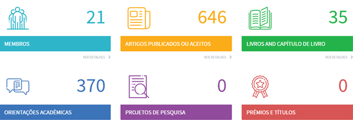</center>
<center>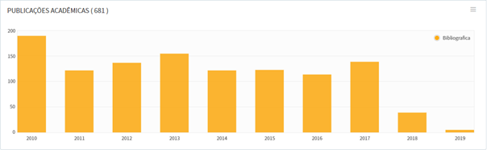</center>
<center>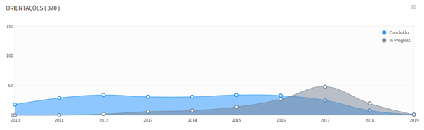</center>

#### Saúde animal

O programa de Pós-graduação em Saúde Animal tem como objetivo qualificar Médicos Veterinários e profissionais de áreas afins para a geração e gestão de conhecimentos na área de Saúde Animal, visando o desenvolvimento social e econômico e a proteção da saúde e bem-estar do homem e dos animais. Fato justificado diante da necessidade de qualificação profissional em áreas estratégicas, garantido a caracterização cada vez mais acentuadamente, da necessária qualificação exigida pelo mercado de trabalho do profissional na área da Medicina Veterinária. Tal exigência vem revelando um mercado altamente competitivo, e que tem como anseio a busca pelo atendimento das exigências crescentes do consumidor final, seja no mercado interno ou externo. Neste contexto, atualizado e altamente competitivo, o programa de Pós-graduação em Saúde Animal visa qualificar profissionais para atuarem no campo da Saúde Animal, área estratégica para o desenvolvimento socioeconômico regional e ainda do País. O programa de Pós-graduação em Saúde Animal disponibiliza os cursos de Mestrado e Doutorado, com duas áreas de concentração “Medicina Preventiva” e “Patologia Veterinária”. 

Linhas de pesquisa:

*	EPIDEMIOLOGIA, PREVENÇÃO E CONTRODE DE DOENÇAS DOS ANIMAIS E GESTÃO DOS RICOS PARA A SAÚDE PÚBLICA.

*	PATOLOGIA VETERINÁRIA.

*	PESQUISA E DESENVOLVIMENTO DE TÉCNICAS CIRÚRGICAS, PROTOCOLOS ANESTÉSICOS E TERAPIAS INOVADORAS.

*	MÉTODOS DE DIAGNÓSTICO E TRATAMENTO DE AFECÇÕES DOS ANIMAIS DOMÉSTICOS E SILVESTRES.

<i>Fonte: PÁGINA DA WEB - HTTP://WWW.FAV.UNB.BR/CURSOS-DE-POS-GRADUACAO/POS-GRADUACAO-EM-SAUDE-ANIMAL</i>

<center>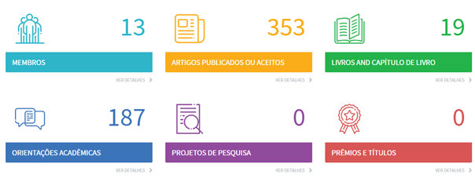</center>
<center>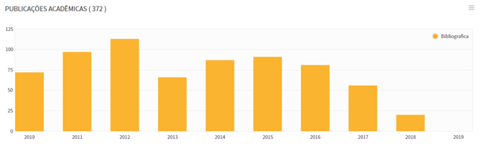</center>
<center>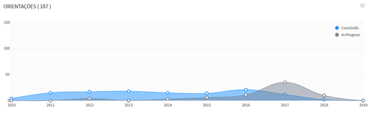</center>

Dados adquiridos da plataforma unb-elattes onde mostram desde número de membros, artigos publicados ou aceitos, livros, orientações acadêmicas, publicações acadêmicas e orientações ao longo dos anos.

#### Outros aspectos que caracterizam a produção científica e acadêmica da UnB

A produção científica da Universidade de Brasília despontou como uma das mais proeminentes do país. Dados revelados pela ferramenta SciVal – utilizada por instituições como Universidade de São Paulo (USP) e Coordenação de Aperfeiçoamento de Pessoal de Nível Superior (Capes) para análise de dados sobre pesquisa – revelam que, em um período de seis anos, o impacto das citações de pesquisadores vinculados à UnB aumentou mais de 100%.
	Em 2016, o chamado impacto normalizado por citação (Field-Weighted Citation Impact, na sigla em inglês) atingiu 1.45, ou seja, os pesquisadores da Universidade foram 45% mais citados do que a média global. Houve também um aumento significativo da produção de artigos. O indicador de produção científica (Scholarly Output) chegou a 9.771 itens em 2016, evidenciando um aumento de 42% nos seis anos considerados na análise.
As equipes dos decanatos de Pós-Graduação (DPG) e de Pesquisa e Inovação (DPI) analisaram as métricas apresentadas pelo software e verificaram relação direta entre o aumento do número de docentes da UnB e da produção científica. Entre os anos de 2009 e 2013, 577 professores ingressaram no quadro permanente da instituição, um aumento de 32%. Entre 2013 e 2016, foram 185 docentes (8%).
“Professores que entraram na UnB na época do Reuni têm, atualmente, forte atuação na pós-graduação. São jovens docentes, adaptados à instituição e que têm muita potência”, afirma a decana de Pós-Graduação, Helena Shimizu.

#### O que a Organização precisa realmente alcançar?

Vários stakeholders estão envolvidos no projeto em curso, e poderíamos considerar cada um deles como distintas organizações que possuem interesses distintos e complementares. Elas são: * A Disciplina Ciência de Dados para Todos 2018.1, que quer comprovar que seus alunos dominam ferramentas e técnicas de ciência de dados, para fins de avaliação de rendimento da disciplina. * A UnB, representada pelos decanatos de pós-graduação (DPG) e de pesquisa e inovação (DPI), que querem dispor de instrumentos para realização de avaliações contínuas de suas pós-graduações. * O SNPG, que assim com o DPG e DPI, também pode se beneficiar do uso de instrumentos para realização de avaliações contínuas de suas pós-graduações. * Os interessados em melhor conhecer o que é produzido pelo Sistema Nacional de Pós-graduação, como empresas privadas, que querem desfrutar dos benefícios gerados pela ciência brasileira. 7 A fim de dar maior fidelidade e homogeneidade ao exercício realizado na disciplina, focaremos em atendimento aos interesses comuns das organizações DPI, DPG e CAPES, que desejam dispor de instrumentos ágeis para avaliação contínua da pós-graduação brasileira. Com base no exposto, o objetivo do trabalho final a ser alcançado pelos produtos de mineração de dados desenvolvido pelos alunos da disciplina Ciência de Dados para Todos é produzir, tomando por base inicial os dados fornecidos pelos professores responsáveis pela disciplina, ferramentas para análise e avaliação contínuas e de baixo custo, do desempenho de um conjunto de pós-graduações que estão vinculadas a uma mesma subárea ou grupo de conhecimento. Cada área de pós-graduação apresenta suas características peculiares, assim como cada um dos programas vinculados a essas áreas. Como já informado, características peculiares de cada programa podem ser obtidas a partir de visita ao sítio da CAPES (2018).

<i>Fonte: FERNANDES, JORGE H C, RICARDO BARROS SAMPAIO, JOÃO RIBAS DE MOURA E JERÔNIMO AVELAR FILHO. “CIÊNCIA DE DADOS PARA TODOS (DATA SCIENCE FOR ALL) - 2018.1</i>

## Avaliação das Circunstâncias

O Sistema de Avaliação desenvolvido pela CAPES pode ser dividido em dois processos distintos que se referem à entrada e permanência dos cursos de mestrado profissional (MP), mestrado acadêmico (ME) e doutorado (DO) no SNPG:

<center>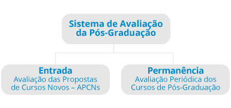</center>

Ambos os processos são conduzidos com base nos mesmos fundamentos:

* Reconhecimento e Confiabilidade fundados na qualidade assegurada pela análise dos pares;

*	Critérios debatidos e atualizados pela comunidade acadêmico-científica a cada período avaliativo;

*	Transparência firmada na ampla divulgação das decisões, ações e resultados:
    *	No portal da CAPES;
    *	Nas páginas das áreas de avaliação.

A Avaliação Quadrienal é parte do processo de Permanência, e é realizada em 49 áreas de avaliação, número vigente em 2017, seguindo sistemática e conjunto de quesitos básicos estabelecidos no Conselho Técnico Científico da Educação Superior (CTC-ES), seguindo o seguinte fluxo:

<center>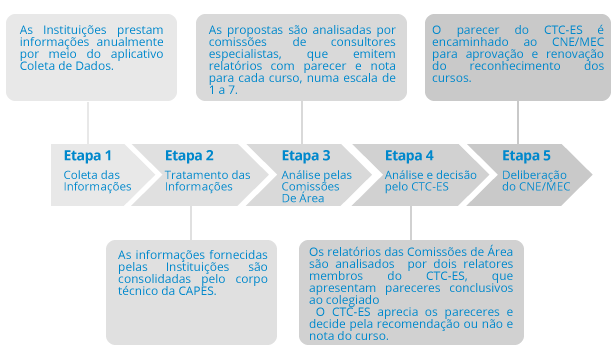</center>

Os resultados da avaliação periódica de programas de pós-graduação são expressos em notas, numa escala de 1 a 7, que são atribuídas aos mestrados e doutorados após análise dos indicadores referentes ao período avaliado. Esta análise é conduzida nas comissões de área de avaliação e, posteriormente, no CTC-ES, que homologa os resultados finais. São estes resultados que fundamentam a deliberação do Conselho Nacional de Educação - CNE/MEC sobre quais cursos obterão a renovação de reconhecimento para a continuidade de funcionamento no período subsequente.

### Avaliação preliminar das pós-graduações na UnB

A Universidade de Brasília obteve avanços em seus programas de pós-graduação (PPG). Avaliada em 93 programas, com cursos de mestrado e de doutorado – tanto acadêmicos quanto profissionais. O período considerado na análise foi de 2013 a 2016. Entre os programas de mestrado profissional, Administração Profissional (Face) alcançou a nota máxima para a categoria, que é 5. Além disso, foi mantida a quantidade de dez programas com nota 6. Para os de nota 5, o aumento foi considerável: em 2013 eles eram 10, agora são 17. Destaque também para os programas criados recentemente, pertencentes a áreas de pesquisa igualmente novas, e que alcançaram boa nota. É o caso do PPG de mestrado e de doutorado em Bioética (FS), que recebeu nota 5, e do curso de mestrado em Metafísica (IH), com 4. 
<i>“A UnB caminha em direção à excelência, à base de muito esforço dos docentes, temos de reconhecer. Há um esforço sobre-humano dos professores, com a cobrança dos indicadores. É muito forte e muito estressante”, reforça a decana do DPG. ”</i>
	
<i>Fonte: http://noticias.unb.br/publicacoes/67-ensino/1801-unb-alcanca-indices-melhores-na-pos-graduacao</i>

#### NANOTECNOLOGIA E NANOBIOTECNOLOGIA

Desde o surgimento do programa de pós-graduação em 2011 a nota apresentada foi 4 e vem se mantendo desde então até o último ano de avaliação 2017 como pode ser visto na imagem obtida na plataforma Sucupira.

<center>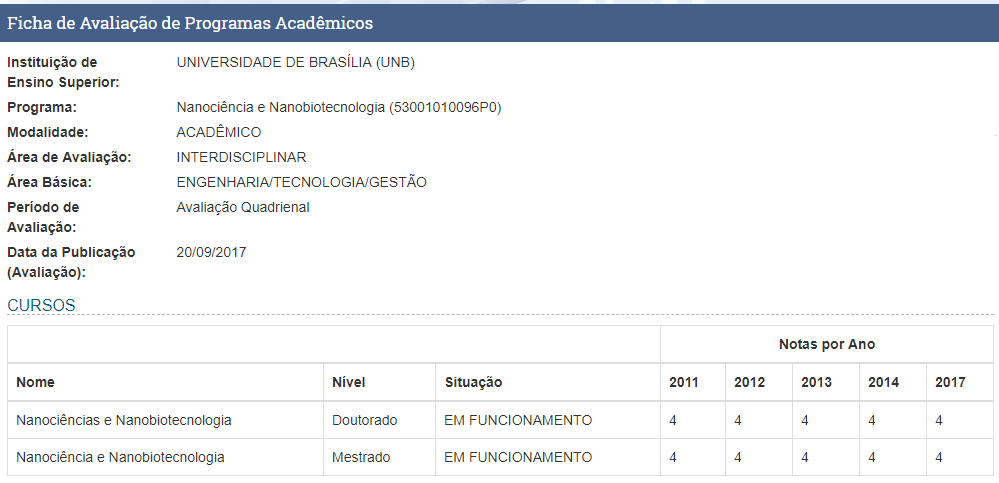</center>

#### SAÚDE ANIMAL

Desde o surgimento do programa de pós-graduação em 2004 a nota apresentada foi 3 e de 2010 para os dias atuais atingiu nota 4 como pode ser visto na imagem obtida na plataforma Sucupira.

<center>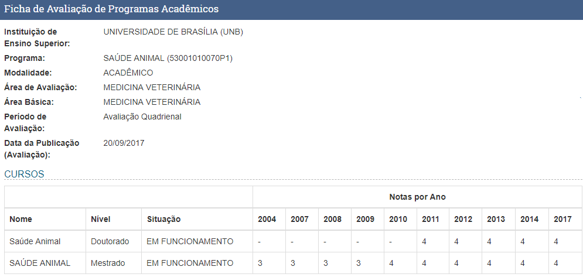</center>

### Avaliação preliminar da produção científica e acadêmica da UnB

O mapeamento foi feito com todos os 91 programas de pós-graduação da UnB, aos quais estão vinculados 2.157 professores, sendo 1.768 do quadro permanente – 389 atuam como colaborador ou pesquisador visitante. Dos docentes permanentes, 20% são bolsistas de produtividade do Conselho Nacional de Desenvolvimento Científico e Tecnológico (CNPq), sendo que metade desses têm reconhecimento de excelência máxima, estando no nível 1.
 
Nos últimos cinco anos, foram desenvolvidos 3.558 projetos de pesquisa e registrados no CNPq 496 grupos de pesquisa, que juntos somam quase 5 mil pesquisadores, sendo que a grande maioria (mais de 60%) não pertence à UnB. “Isso significa que a Universidade tem muita colaboração externa e se relaciona com outras instituições, o grupo não é endógeno, mas aberto para o mundo”, interpreta Cláudia Amorim.

<center>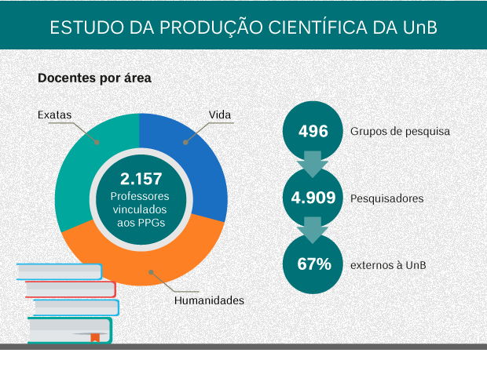</center>

Mais de 1.500 pesquisadores da UnB integram grupos de pesquisa registrados no CNPq. Arte: Igor Outeiral/Secom UnB
 
Entre 2014 e 2017, a UnB teve uma produção de 15.578 publicações em periódicos qualificados, sendo mais da metade internacionais (54%) e quase um terço (28%) com as notas máximas de avaliação da Capes (A1 e A2). Quanto às bases, 4.271 artigos estão na Scopus e 2.367 na Web of Science e Scielo. A média de trabalhos nessas bases é de 7,49 por professor.
Dois indicadores muito expressivos são o número de citações e o índice-H, também conhecido como fator de impacto. As citações correspondem ao número de vezes que um trabalho foi utilizado como referência e o índice-H relaciona o quantitativo de publicações científicas com o de suas citações, ou seja, quantos artigos um pesquisador publicou e quantas vezes foram referenciados.

<center>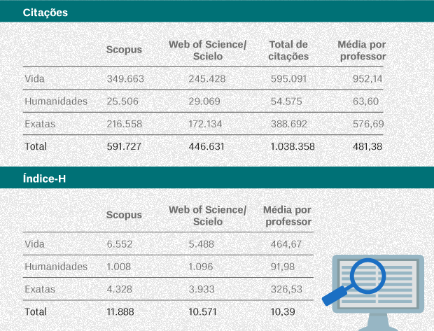</center>

<i>O Scielo está integrado à base Web of Science. Arte: Igor Outeiral/Secom UnB</i>
 
Os profissionais envolvidos nesse estudo destacam que, embora traga importantes indicadores, há que se considerar as especificidades das áreas. Por exemplo, as Ciências Humanas e Sociais Aplicadas têm mais grupos de pesquisa, mas por outro lado, o número de publicações em periódicos não é tão expressivo como as Ciências da Vida ou Exatas. 
Embora as Humanidades tenham um índice-H mais baixo nas bases de dados, trata-se de um campo internacionalizado. Além de ser a área com mais grupos de pesquisa, as Ciências Humanas ou Sociais detêm mais da metade (55%) dos cursos de excelência da UnB.

# CRISP-DM Fase 2 - Entendimento dos Dados

## CRISP-DM Fase 2.1 - Coleta inicial dos dados

Todos os arquivos com dados iniciais a seguir apresentados foram fornecidos pelos professores responsáveis pela disciplina. Os dados foram gerados no mês de outubro de 2019, e compilam informações entre os anos de 2010 e 2017. Os arquivos estão no formato JSON, e seus atributos iniciais e conteúdo são apresentados a seguir.

<i>Fonte: http://unb.elattes.com.br/
Fonte: FERNANDES, JORGE H C, RICARDO BARROS SAMPAIO, JOÃO RIBAS DE MOURA E JERÔNIMO AVELAR FILHO. “CIÊNCIA DE DADOS PARA TODOS (DATA SCIENCE FOR ALL) - 2018.1</i>

### Perfil profissional dos docentes vinculados às pós-graduações

```{r }
file.info("834.profile.json")
file.info("847.profile.json")
```
Arquivo 834.profile.json e 847.profile.json apresentam dados sobre o perfil de todos os docentes vinculados a programas de pós-graduação da UnB. Arquivo foi fornecido pelos docentes responsáveis pela disciplina.

### Orientações de mestrado e doutorado realizadas pelos docentes vinculados às pós-graduações

```{r }
file.info("834.advise.json")
file.info("847.advise.json")
```
Arquivo 834.advise.json e 847.advise.json apresentam dados sobre o perfil de todos os docentes vinculados a programas de pós-graduação da UnB. Arquivo foi fornecido pelos docentes responsáveis pela disciplina.

### Produção bibliográfica gerada pelos docentes vinculados às pós-graduações

```{r }
file.info("834.publication.json")
file.info("847.publication.json")
```
Arquivo 834.publication.json e 847.publication.json apresentam dados sobre publicações de todos os docentes vinculados a programas de pós-graduação da UnB. Arquivo foi fornecido pelos docentes responsáveis pela disciplina.

### Redes de colaboração entre docentes

```{r }
file.info("834.graph.json")
file.info("847.graph.json")
```
Arquivo 834.graph.json e 847.graph.json apresentam dados sobre a rede de colaboração de todos os docentes vinculados a programas de pós-graduação da UnB. Arquivo foi fornecido pelos docentes responsáveis pela disciplina.

## CRISP-DM Fase 2.2 - Descrição dos Dados

Todos os scripts a seguir apresentados foram reutilizados de relatórios base fornecidos pelos professores responsáveis pela disciplina. Os pacotes utilizados para descrição destes dados podem ser encontrados no site da R Studio.

<i>Fonte: FERNANDES, JORGE H C, RICARDO BARROS SAMPAIO, JOÃO RIBAS DE MOURA E JERÔNIMO AVELAR FILHO. “CIÊNCIA DE DADOS PARA TODOS (DATA SCIENCE FOR ALL) - 2018.1</i>

### Descrição dos pacotes utilizados

```{}
#Pacotes Utilizados
library(tidyverse)
library(jsonlite);
library(listviewer)
library(igraph)
library(rJava)
library(qdap)
library(tm)
library(wordcloud)
```

```{r include=FALSE}
#Pacotes Utilizados
library(tidyverse)
library(jsonlite);
library(listviewer)
library(igraph)
library(rJava)
library(qdap)
library(tm)
library(wordcloud)

#Pasta com códigos e arquivos
setwd("C:/Users/berna/Desktop/nanotecnologia&saude_animal") #Pasta contendo os arquivos

#upload de arquivo com funções para transformar listas em Data Frames e objeto igraph
source("elattes.ls2df.R")
```
Os pacotes apresentados foram utilizados para melhor coleta de dados dos arquivos de análise

### Descrição dos dados do perfil

#Leitura de arquivos de nanociência_nanobiotecnologia e saúde_animal
```{r}
perfil_nano <- fromJSON("JSON/834.profile.json")
perfil_saude <- fromJSON("JSON/847.profile.json")

perfil_nano <- fromJSON("JSON/834.profile.json")
perfil_saude <- fromJSON("JSON/847.profile.json")

public_nano <- fromJSON("JSON/834.publication.json")
public_saude <- fromJSON("JSON/847.publication.json")

orient_nano <- fromJSON("JSON/834.advise.json")
orient_saude <- fromJSON("JSON/847.advise.json")

graphl_nano <- fromJSON("JSON/834.graph.json")
graphl_saude <- fromJSON("JSON/847.graph.json")
```
Leitura dos arquivos JSON referentes aos participantes dos programas da UNB.
```{r }
# Número de Pessoas que participam dos programas
length(perfil_nano)
length(perfil_saude)
```
Quantidade de participantes do programa de nanotecnologia e saúde animal respectivamente.
```{r }
# Descricao de perfil de docente
glimpse(perfil_nano[[1]], width = 5)
```
Breve descrição de como são apresentados os dados referentes ao perfil de cada docente no arquivo JSON.

### Descrição os dados de orientações
```{r }
# Descricao dos dados de orientacoes
names(orient_nano)
```
Exemplo da descrição de dados de um dos programas estudados no relatório.

### Descrição dos dados de produção bibliográfica
```{r }
# Descricao dos dados bibliograficos
names(public_nano)
```
Descrição do formato em que os dados de publicações são apresentados no JSON.

## CRISP-DM Fase 2.3 - Análise exploratória dos dados

Com base nos dados descritos na sessão anterior poderemos fazer uma análise mais profunda de informações que nos ajude a entender algumas características especificas dos programas avaliados neste relatório.

### Analise do arquivo profile

```{r}
#Leitura de arquivos de nanociencia_nanobiotecnologia e saude_animal
perfil_nano <- fromJSON("JSON/834.profile.json")
perfil_saude <- fromJSON("JSON/847.profile.json")
```

A partir da extração dos arquivos podemos facilmente retirar informações a respeito de ambos os programas como por exemplo:

#### Numero de participantes Nanobiotecnologia

```{r}
#Número de Pessoas que participam dos programas
length(perfil_nano)
length(perfil_saude)
```

#### Numero de participantes Saúde Animal

```{r}
#Número de Pessoas que participam dos programas
length(perfil_nano)
length(perfil_saude)
```

Os integrantes do programa de nanociência e nanotecnologia e um pouco maior que do programa de saúde animal podendo levantar hipóteses relevantes a dados futuros como maior número de publicações e de artigos aceitos mais a frente veremos se estas indagações conferem.

#### Numero de produções ao ano Nanociência Nanobiotecnologia

```{r}
# Número de produções por ano
str("ARTIGO_ACEITO")
table(unlist(sapply(perfil_nano, function(x) (x$producao_bibiografica$ARTIGO_ACEITO$ano))))
str("LIVROS")
table(unlist(sapply(perfil_nano, function(x) (x$producao_bibiografica$LIVRO$ano))))
str("TEXTOS_EM_JORNAIS")
table(unlist(sapply(perfil_nano, function(x) (x$producao_bibiografica$TEXTO_EM_JORNAIS$ano))))
```

#### Numero de produções ao ano Saúde Animal
```{r}
# Número de produções por ano
str("ARTIGO_ACEITO")
table(unlist(sapply(perfil_saude, function(x) (x$producao_bibiografica$ARTIGO_ACEITO$ano))))
str("LIVROS")
table(unlist(sapply(perfil_saude, function(x)
(x$producao_bibiografica$LIVRO$ano))))
str("TEXTOS_EM_JORNAIS")
table(unlist(sapply(perfil_saude, function(x) (x$producao_bibiografica$TEXTO_EM_JORNAIS$ano))))
```
A Partir dos dados percebemos que nanociência além de ter um número de artigos aceitos por ano do que saúde animal, consequentemente o número de livros publicados ao ano é maior além de publicações de textos em jornais e revistas.

#### Numero de pessoas por área Nanociência Nanobiotecnologia
```{r}
# Número de pessoas por grande area
table(unlist(sapply(perfil_nano, function(x) (x$areas_de_atuacao$grande_area))))
```
#### Numero de pessoas por área Saúde Animal
```{r}
# Número de pessoas por grande area
table(unlist(sapply(perfil_saude, function(x) (x$areas_de_atuacao$grande_area))))
```
Script exemplo que gera os gráficos pizza dos dados acima:

```{r}
#Converte perfil_nano e perfil_saude em data frame
dataframe_perfil_nano <- extrai.perfis(perfil_nano)
dataframe_perfil_saude <- extrai.perfis(perfil_saude)

#Distribuiçao de pesquisadores por grandes áreas
area_atuacao_nano <- extrai.areas.atuacao(perfil_nano)
area_atuacao_saude <- extrai.areas.atuacao(perfil_saude)

ggplot(area_atuacao_nano, aes(x = 1, y = grande_area, fill = grande_area)) +
  # Use a column geometry.
  geom_col() +
  # Change coordinate system to polar.
  coord_polar(theta = "y") +
  theme_void() +
  # Clean up the background with theme_void and give it a proper title with ggtitle.
  ggtitle("Distribuição de pesquisadores por grande área na Nanociência e Nanobiotecnologia")

ggplot(area_atuacao_saude, aes(x = 1, y = grande_area, fill = grande_area)) +
  # Use a column geometry.
  geom_col() +
  # Change coordinate system to polar.
  coord_polar(theta = "y") +
  theme_void() +
  # Clean up the background with theme_void and give it a proper title with ggtitle.
  ggtitle("Distribuição de pesquisadores por grande área na Saúde Animal")
```

Analisando os gráficos acima vemos que o programa de nanociência possui grande diversidade nas grandes áreas tendo grande influência em ciências exatas, biológicas e engenharias. Já o programa de saúde animal que não possui tanta diversidade, mas possui grande participação nas áreas agrarias e biológicas.

#### Número de pessoas que produziram os específicos tipos de produção Nanociência Nanobiotecnologia

```{r}
# Número de pessoas que produziram os específicos tipos de produção
table(unlist(sapply(perfil_nano, function(x) names(x$producao_bibiografica))))
```

#### Número de pessoas que produziram os específicos tipos de produção Saúde Animal

```{r}
# Número de pessoas que produziram os específicos tipos de produção
table(unlist(sapply(perfil_saude, function(x) names(x$producao_bibiografica))))
```

Com base nos dois programas podemos ver que a de certa forma uma relação muito próxima quando se trata de números de artigos aceitos, eventos e livros, mas que se olharmos para periódicos textos em jornais entre outros, vemos uma discrepância entre ambos, podemos supor que este fato seja porque historicamente pesquisas na área da saúde tendem a demorar que em outras áreas.

### Analise do arquivo Publicações

```{r}
# Leitura de arquivos de nanociencia_nanobiotecnologia e saude_animal
public_nano <- fromJSON("JSON/834.publication.json")
public_saude <- fromJSON("JSON/847.publication.json")

# Análise dos dados no formato DF
public_nano.periodico.df <- pub.ls2df(public_nano, 1) #artigos
public_nano.livros.df <- pub.ls2df(public_nano, 2) #livros
public_nano.eventos.df <- pub.ls2df(public_nano, 5) #eventos

public_saude.periodico.df <- pub.ls2df(public_saude, 1) #artigos
public_saude.livros.df <- pub.ls2df(public_saude, 2) #livros
public_saude.eventos.df <- pub.ls2df(public_saude, 5) #eventos
```
Após a extração dos dados de publicações podemos encontrar informações a respeito dos programas.

#### Publicações de artigos Nanociência Nanobiotecnologia

```{r}
# Publicação por ano
table(public_nano.periodico.df$ano)
```

#### Publicações de artigos Saúde Animal

```{r}
# Publicação por ano
table(public_saude.periodico.df$ano)
```
Podemos observar que ambos os programas mantiveram uma taxa de publicações ao ano significativa, fica evidente através dos dados que o programa de nanociência desde o primeiro ano estudado já possuía 82 periódicos no ano contra 30 de saúde animal.

#### Publicações de livros Nanociência Nanobiotecnologia
```{r}
# Publicação de livros por pais
table(public_nano.livros.df$pais_de_publicacao)
```
#### Publicações de livros Saúde Animal
```{r}
# Publicação de livros por pais
table(public_saude.livros.df$pais_de_publicacao)
```
Percebemos que o programa de nanociência possui uma internacionalização maior que saúde animal já que ao analisarmos os livros publicados por países vemos que nanociência possui livros publicados em diversos países enquanto que saúde possuí 2 livros publicados no Brasil.

#### Participação de eventos Nanociência Nanobiotecnologia
```{r}
# Eventos nos países ao longo dos anos
public_nano.eventos.df %>%
  filter(pais_do_evento %in%
           c(names(head(sort(table(public_nano.eventos.df$pais_do_evento)
                             , decreasing = TRUE), 10)))) %>%
  group_by(ano_do_trabalho,pais_do_evento) %>%
  ggplot(aes(x=ano_do_trabalho,y=pais_do_evento, color= pais_do_evento)) +
  xlab("Ano") + ylab("Pais") + geom_point() + geom_jitter() +
  ggtitle("Eventos de Nanobiotecnlogia nos países ao longo dos anos")
```

#### Participação de eventos Saúde animal

```{r}
# Eventos nos países ao longo dos anos
public_saude.eventos.df %>%
  filter(pais_do_evento %in%
           c(names(head(sort(table(public_nano.eventos.df$pais_do_evento)
                             , decreasing = TRUE), 10)))) %>%
  group_by(ano_do_trabalho,pais_do_evento) %>%
  ggplot(aes(x=ano_do_trabalho,y=pais_do_evento, color= pais_do_evento)) +
  xlab("Ano") + ylab("Pais") + geom_point() + geom_jitter() +
  ggtitle("Eventos de Saúde Animal nos países ao longo dos anos")
```

Após analisar os gráficos, percebe-se que a quantidade de eventos ocorridos sobre o programa de nanotecnologia é ligeiramente maior nos países como: Estados Unidos, Alemanha, Brasil em relação a saúde animal. Mesmo com essa discrepância, conclui-se que a presença de ambos programas em determinados países estrangeiros, ainda é pequena se comparada ao Brasil.

#### Analise do arquivo Orientações

```{r include=FALSE}
# Leitura de arquivos de nanociencia_nanobiotecnologia e saude_animal
orient_nano <- fromJSON("JSON/834.advise.json")
orient_saude <- fromJSON("JSON/847.advise.json")

# Análise dos dados no formato DF
orient_nano.posdoutorado.df <- ori.ls2df(orient_nano, 6) #pos-Doutorado concluído
orient_nano.doutorado.df <- ori.ls2df(orient_nano, 7) #Doutorado concluído
orient_nano.mestrado.df <- ori.ls2df(orient_nano, 8) #Mestrado concluído
orient_nano.df <- rbind(rbind(orient_nano.posdoutorado.df, orient_nano.doutorado.df), orient_nano.mestrado.df)

orient_saude.posdoutorado.df <- ori.ls2df(orient_saude, 6) #pos-Doutorado concluído
orient_saude.doutorado.df <- ori.ls2df(orient_saude, 7) #Doutorado concluído
orient_saude.mestrado.df <- ori.ls2df(orient_saude, 8) #Mestrado concluído
orient_saude.df <- rbind(rbind(orient_saude.posdoutorado.df, orient_saude.doutorado.df), orient_saude.mestrado.df)
```
Após a extração dos dados de orientações podemos encontrar informações a respeito dos programas.

#### Numero de orientações de doutorado Nanociência e Nanobiotecnlogia
```{r}
# Número de Orientações de Doutorado
sum(sapply(orient_nano$ORIENTACAO_CONCLUIDA_DOUTORADO, function(x) length(x$natureza)))
```
#### Numero de orientações de doutorado Saúde Animal
```{r}
# Número de Orientações de Doutorado
sum(sapply(orient_saude$ORIENTACAO_CONCLUIDA_DOUTORADO, function(x) length(x$natureza)))
```
Quando se trata de número de orientações concluídas de doutorado há uma discrepância enorme entre ambos os programas.

#### Numero de bolsas Nanociência e Nanobiotecnlogia

```{r}
# Orientaçoes que recebem bolsas 
table(orient_nano.df$bolsa)
```

#### Numero de bolsas Saúde Animal

```{r}
# Orientaçoes que recebem bolsas
table(orient_saude.df$bolsa)
```
Claramente os participantes do programa de nanociência recebem mais recurso do que os demais de saúde animal, sendo assim um programa que atrai mais investidores para a causa.

```{r}
# Natureza das orientacoes completas por ano
ggplot(orient_nano.df,aes(ano,fill=natureza)) +
  geom_bar(stat = "count", position="dodge") +
  ggtitle("Natureza das orientações completas por ano de Nanociência e Nanobiotecnologia") +
  theme(legend.position="right",legend.text=element_text(size=7)) +
  guides(fill=guide_legend(nrow=5, byrow=TRUE, title.position = "top")) +
  labs(x="Ano",y="Quantidade")

ggplot(orient_saude.df,aes(ano,fill=natureza)) +
  geom_bar(stat = "count", position="dodge") +
  ggtitle("Natureza das orientações completas por ano de Saúde Animal") +
  theme(legend.position="right",legend.text=element_text(size=7)) +
  guides(fill=guide_legend(nrow=5, byrow=TRUE, title.position = "top")) +
  labs(x="Ano",y="Quantidade")
```

Ambos os programas têm altos índices de dissertações de mestrado, logo o fator que diferencia esses dois programas são as supervisões de pós-doutorado e tese de doutorado que podem ter um número bem reduzido no programa de saúde animal.

# CRISP-DM Fase 4 – Modelagem

## CRISP-DM Fase.Atividade 4.1 - Seleção das técnicas de modelagem

### Analise de rede - Networking

A teoria dos grafos é um ramo da matemática que estuda as relações entre os objetos de um determinado conjunto. Para tal são empregadas estruturas chamadas de grafos, onde um conjunto não vazio de objetos denominados vértices (ou nós) ligados atraves de arestas. Dependendo da aplicação, arestas podem ou não ter direção, pode ser permitido ou não arestas ligarem um vértice a ele próprio e vértices e/ou arestas podem ter um peso (numérico) associado. Se as arestas têm uma direção associada (indicada por uma seta na representação gráfica) temos um dígrafo (grafo orientado).

<i>Fonte: https://pt.wikipedia.org/wiki/Teoria_dos_grafos</i>

<center>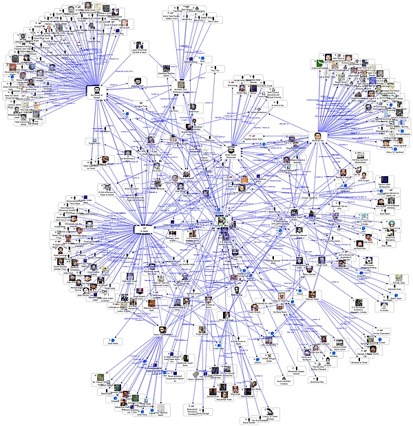</center>
<i>Fonte: Facebook TouchGraph connections</i>

### Mineração de Texto - Text Mining

Mineração de texto, conhecida também como mineração de dados textuais e semelhante à análise textual, refere-se ao processo de obtenção de informações importantes de um texto. Informações importantes são obtidas normalmente pela elaboração de padrões e tendências através de meios como o padrão estatístico de aprendizagem. Geralmente a mineração de texto envolve o processo de estruturação do texto de entrada (frequentemente análise, junto com a adição de algumas características linguísticas derivadas e com a retirada de outras, e com a subsequente inserção em um banco de dados), de derivação de padrões dentro da estrutura de dados e, por fim, de avaliação e interpretação do resultado. A análise de texto envolve informações de recuperação, análise lexical a fim de estudar a frequência de distribuição de palavras, reconhecimento de padrões, identificação/anotação, extração de informações, técnicas de mineração de dados que incluem link e associação de análises, visualização e analítica preditiva.

<i>Fonte: https://pt.wikipedia.org/wiki/Minera%C3%A7%C3%A3o_de_texto</i>

<center></center>
<i>Fonte: https://data-flair.training/blogs/text-mining/</i>

## CRISP-DM Fase.Atividade 4.2 - Realização de testes de modelagem

Todos os scripts a seguir apresentados foram reutilizados de relatórios base fornecidos pelos professores responsáveis pela disciplina. Os pacotes utilizados para descrição destes dados podem ser encontrados no site da R Studio.

### Distância entre participantes dos programas de pós graduação - Networking

A interconectividade de uma rede pode ser avaliada examinando o número e o comprimento dos caminhos entre os vértices. Um caminho é simplesmente a cadeia de conexões entre vértices. O número de arestas intermediárias entre dois vértices representa a distância geodésica entre os vértices. Os indivíduos que estão conectados um ao outro têm uma distância de 1. Os que compartilham um vizinho em comum, mas não estão conectados um ao outro, têm uma distância de 2 e assim por diante.

#### Distancia em Nanobiotecnologia

```{r}
#Grafo de nanobiotecnologia
g <- g.ls2ig(graphl_nano)

# Quais sao os dois vertices mais afastados do grafo?
farthest_vertices(g) 

# Mostra o caminho que estes vertices mais distantes tem que percorrer para se encontrarem
get_diameter(g)  
```

Vemos que no programa a maior distancia entre os dois mais afastados membros é de apenas 3, isso mostra que a grande maioria dos participantes realizam projetos de pesquisa entre si.

#### Distância em Saúde Animal

```{r}
#Grafo de saude animal
g <- g.ls2ig(graphl_saude)

# Quais sao os dois vertices mais afastados do grafo?
farthest_vertices(g) 

# Mostra o caminho que estes vertices mais distantes tem que percorrer para se encontrarem
get_diameter(g)  
```

Vemos que no programa a maior distancia entre os dois mais afastados membros é de apenas 4, isso mostra que os participantes são mais um pouco mais distantes ao compará-los ao programa anterior.

### Centralidade e influência nos programas de pós-graduação - Networking

Indivíduos com alta centralidade de vetor próprio são aqueles que estão altamente conectados a outros indivíduos altamente conectados.

#### Centralidade e influência em Nanobiotecnologia
```{r}
#Grafo de nanobiotecnologia
g <- g.ls2ig(graphl_nano)

# identificando os nós chaves usando eigenvector_centrality
g.ec <- eigen_centrality(g)
which.max(g.ec$vector)

colors <- c("#006699", "#00cc66", "#cccc00", "#ff3300", "#ff0066", "#ff6600", "#cc3300",
            "#ff99cc", "#ff6699", "#99ccff", "#00ff99", "#cc99ff", "#99ff33", "#ccff66",
            "#99ff66", "#ffff00", "#9999ff", "#ff00ff", "#ff9999", "#0099ff", "#cc9900")

# Atribuindo cores aos vertices da rede g
V(g)$color <- colors

# Plot grafo nanobiotecnologia
plot(g,
     vertex.label.color = "black",
     vertex.label.cex = 0.6,
     vertex.size = 25*(g.ec$vector),
     edge.color = 'gray88',
     main = "Rede de influência centralizada"
)
```

Podemos observar através da centralidade e pela dimensão das esferas que a grande maioria dos participantes do programa de nanobiotecnologia possuem uma boa iteração entre si, salvo alguns casos, isso mostra que o programa em sua maioria possui uma boa relação entre seus participantes em projetos de pesquisa.

#### Centralidade e influência em Saúde Animal

```{r}
#Grafo de Saude Animal
g <- g.ls2ig(graphl_saude)

# identificando os nós chaves usando eigenvector_centrality
g.ec <- eigen_centrality(g)
which.max(g.ec$vector)

colors <- c("#006699", "#00cc66", "#cccc00", "#ff3300", "#ff0066", "#ff6600", "#cc3300",
            "#ff99cc", "#ff6699", "#99ccff", "#00ff99", "#cc99ff", "#99ff33", "#ccff66",
            "#99ff66", "#ffff00", "#9999ff", "#ff00ff", "#ff9999", "#0099ff", "#cc9900")

# Atribuindo cores aos vertices da rede g
V(g)$color <- colors

# Plot grafo nanobiotecnologia
plot(g,
     vertex.label.color = "black",
     vertex.label.cex = 0.6,
     vertex.size = 25*(g.ec$vector),
     edge.color = 'gray88',
     main = "Rede de influência centralizada"
)
```

Diferente da análise anterior observamos que há pessoas que possuem uma grande influência no programa se comparado outras, com isso novos participantes do programa tem uma tendência maior a se relacionar com essas pessoas, este comportamento pode esta associado a características intelectuais como formações, experiências, alem de características sociais como trabalho em equipe entre outros.

### Identificando sub-redes entre participantes dos programas de pós-graduação - Networking

Identificar sub-redes, clusters ou popularmente falando "panelinhas" é uma prática comum em redes não direcionadas. Em uma sub-rede, todos os dois nós únicos são adjacentes - isso significa que cada nó individual está conectado a todos os outros nós da sub-rede. Freqüentemente, na visualização da rede, é necessário sub-conectar parte de uma rede para inspecionar as interconexões de vértices específicos.

#### Maior sub-rede em Nanobiotecnologia

```{r echo=FALSE}
#Grafo de nanobiotecnologia
g <- g.ls2ig(graphl_nano)

# atribuindo largest_cliques ao objeto lc
lc <- largest_cliques(g)

# Criando dois novos subgrafos nao difecionados cada um contendo somente os vertices com as maiores panelinhas
gs1 <- as.undirected(subgraph(g, lc[[1]]))

plot(gs1,
     vertex.label.color = "black",
     vertex.label.cex = 0.9,
     vertex.size = 0,
     edge.color = 'gray28',
     main = "Sub-rede ou cluster",
     layout = layout.circle(gs1)
)
```

Os participantes mostrados acima se comunicam mais entre si do que com outros participantes da rede no geral, este comportamento pode ser visto como criações de grupos de pesquisa em projetos de pesquisa, participações em publicações de artigos entre outros.

#### Maior sub-rede em Saúde Animal

```{r echo=FALSE}
#Grafo de saude animal
g <- g.ls2ig(graphl_saude)

# atribuindo largest_cliques ao objeto lc
lc <- largest_cliques(g)

# Criando dois novos subgrafos nao difecionados cada um contendo somente os vertices com as maiores panelinhas
gs1 <- as.undirected(subgraph(g, lc[[1]]))

plot(gs1,
     vertex.label.color = "black",
     vertex.label.cex = 0.9,
     vertex.size = 0,
     edge.color = 'gray28',
     main = "Sub-rede ou cluster",
     layout = layout.circle(gs1)
)
```

Percebe-se que diferente do programa anterior esta sub-rede possui menos indivíduos, logo podemos deduzir que os grupos de pesquisa formados em saúde animal possui um pouco menos de integrantes.

### Limpando o texto

A limpeza do texto ajuda a agregar termos. Por exemplo, pode fazer sentido que as palavras "mineiro", "mineração" e "mina" sejam consideradas um termo. Etapas específicas de pré-processamento variam de acordo com o projeto. Por exemplo, as palavras usadas nos tweets são muito diferentes daquelas usadas em documentos legais, portanto, o processo de limpeza também pode ser bem diferente.

#### Limpando artigos de Nanociência e Nanobiotecnologia
```{r}
# Texto puro
public_nano.periodico.df$titulo[1]
```
O artigo de nanobiotecnologia usado acima como exemplo talvez possua informações que não sejam tão relevantes para nossas análises posteriores então cabe a nós retira-los de forma que nossos dados fiquem de forma mais limpa possível, para isso fazemos uma série de procedimentos que vão desde retirada de pontuações, espaços extras em branco e símbolos até mesmo retirada de palavras irrelevantes.

```{r}
public_n <- tolower(public_nano.periodico.df$titulo)
# Remove pontuaççao
public_n <- removePunctuation(public_n)
# Remove numeros
public_n <- removeNumbers(public_n)
# Remove espaços em branco
public_n <- stripWhitespace(public_n)
new_stopwords <- c(stopwords("en"), stopwords("pt-br"), Top200Words)
# Print text without standard stop words
public_n <- removeWords(public_n, new_stopwords)
public_n[1]
```
Depois de executado tais procedimentos de limpeza vemos que nossos dados possuem apenas palavras chaves para nossos objetivos de análises.

#### Limpando artigos de Saúde Animal

```{r}
# Texto puro
public_saude.periodico.df$titulo[1]
```
O elemento de saúde animal usado acima como exemplo talvez possua informações que não sejam tão relevantes para nossas análises posteriores então cabe a nós retira-los de forma que nossos dados fiquem de forma mais limpa possível, para isso fazemos uma série de procedimentos que vão desde retirada de pontuações, espaços extras em branco e símbolos até mesmo retirada de palavras irrelevantes.

```{r}
public_s <- tolower(public_saude.periodico.df$titulo)
# Remove pontuaççao
public_s <- removePunctuation(public_s)
# Remove numeros
public_s <- removeNumbers(public_s)
# Remove espaços em branco
public_s <- stripWhitespace(public_s)
new_stopwords <- c(stopwords("en"), stopwords("pt-br"), Top200Words)
# Print text without standard stop words
public_s <- removeWords(public_s, new_stopwords)
public_s[1]
```
Depois de executado tais procedimentos de limpeza vemos que nossos dados possuem apenas palavras chaves para nossos objetivos de análises.

### Termos mais frequentes citados em publicações - Text Mining

Às vezes, podemos descobrir a intenção do autor e as principais idéias apenas observando as palavras mais comuns. Em essência, a mineração de texto com um monte de palavras representa uma maneira de contar termos, ou n gramas, em uma coleção de documentos.

#### Termos mais frequentes citados em nanobiotecnologia

```{r}
# Achando os 25 termos mais frequentes
term_count <- freq_terms(public_n, 25)
# Plot term_count
plot(term_count)
```

Vemos que as palavras mais frequentes citadas no programa remetem ao tema do programa em si, como nanopartículas, células, magnético, alem de outras palavras que nos levam a pensar que muitas destas publicações são voltadas para a área da saúde um exemplo seria as palavras terapia e câncer.

#### Termos mais frequentes citados em nanociência e nanobiotecnologia

```{r}
# Achando os 25 termos mais frequentes
term_count <- freq_terms(public_s, 25)
# Plot term_count
plot(term_count)
```

Vemos que as palavras mais frequentes citadas no programa remetem ao tema do programa em si, como bois, cavalos, equinos, alem de outras palavras que nos levam a pensar que muitas destas publicações são desenvolvidas no brasil.

### Nuvens de palavras

Uma nuvem de palavras (também conhecida como nuvem de tags ou texto) é uma representação visual da frequência e do valor das palavras. Ela é usado para destacar com que frequência um termo ou categoria específica aparece em uma fonte de dados. Quanto mais vezes uma palavra-chave estiver presente em um conjunto de dados, maior e mais forte será a palavra-chave.

<i>Fonte: https://infogram.com/pt/criar/nuvem-de-palavra</i>

#### Nuvens de palavras em Nanociência e Nanobiotecnologia

```{r}
# Achando os 25 termos mais frequentes
term_count <- freq_terms(public_n, 25)
# Cria uma nuvem de palavras para valores de frequencia de palavras
wordcloud(term_count$WORD,term_count$FREQ, max.words = 25, colors = c("grey80","darkgoldenrod1","tomato"))
```

As palavras com maior destaque, nós leva a pensar que a maior parte dos artigos publicados tem como foco o estudo de nanopartículas em células. Em contra partida percebemos que os artigos tendem a focar nesses temas mais específicos de estudos.

#### Nuvens de palavras em Saúde Animal

```{r}
# Achando os 25 termos mais frequentes
term_count <- freq_terms(public_s, 25)
# Cria uma nuvem de palavras para valores de frequencia de palavras
wordcloud(term_count$WORD,term_count$FREQ, max.words = 25, colors = c("grey80","darkgoldenrod1","tomato"))
```

As palavras com maior destaque, nós leva a pensar que a maior parte dos artigos publicados tem como foco o estudo de animais de pecuária e domésticos em tratamento de doenças e prevenções, sendo que usam o Distrito Federal e Goiás como base de pesquisa. Em contra partida percebemos que os artigos ao contrário do analisado anteriormente possui uma maior diversidade de temas como focos de pesquisa.

# CRISP-DM Fase 5 – Avaliação

## CRISP-DM Fase.Atividade 5.1 - Avaliação dos resultados

Depois de contextualizar o que é ciência e como é no Brasil implementamos a metodologia CRISP-DM para a obtenção e analise de dados dos programas de pós-graduação Nanociência Nanobiotecnologia e Saúde Animal afim de extrairmos informações que podem ser úteis para compreendermos a realidade de ambos programas de pós graduação da Universidade de Brasília.

Buscamos entender o que seria o sistema de pós graduações no brasil, os colégios e as grandes áreas da pós graduação Brasileira, como funcionava o sistema de avaliações dos programas as etapas a serem realizadas, além de estudarmos ferramentas criadas para facilitar nosso entendimento destas analises realizadas pela CAPES através da plataforma SUCUPIRA, e qual seria o papel da UNB neste sistema.

Logo após o entendimento de negócio seguimos com o entendimento dos dados dos programas a serem estudados, desde coleta inicial de arquivos extraídos em plataformas desenvolvidas como o <i>http://unb.elattes.com.br/</i> para obtenção dos arquivos a serem utilizados como perfis dos participantes, publicações, orientações, e rede. Buscando assim a descrição destes elementos para melhor compreender o objeto de estudo através da analise exploratória dos dados.

Já nesta fase de analise exploratória percebemos que os dois programas que foram estudados possuem algumas diferenças entre si desde numero de integrantes, numero de artigos publicados, e áreas de atuação. Com isso baseado em resultados obtidos extraídos de gráficos podemos perceber que o programa de nanociência por ter mais integrantes possuía um maior numero de artigos publicados por ano, alem de participar de mais eventos.

Na modelagem de dados utilizamos a analise de rede como ferramenta para compreender o relacionamento entre os participantes dos programas de pós graduação, alem da mineração de texto sobre os arquivos de publicações de ambos programas. Percebemos assim que no programa de nanociência nanobiotecnologia os participantes salvo em alguns casos se relacionavam muito entre si diferente do programa de saúde animal que já possuía alguns indivíduos que se relacionavam mais que outros. Alem de identificarmos subgrupos formados dentro dos programas onde reforça este tipo de relacionamento na produção de pesquisa.

Ao extrairmos informações com respeito as publicações vimos que ambos os programas tem o foco de pesquisa voltados para áreas que remetem ao conceito do programa em si alem de buscar relacionar estes temas com problemas do cotidiano a fim de buscar soluções.

Concluímos que apos tal analises ambos os programas mesmo não possuindo tantos participantes não deixam de abranger varias áreas de atuações alem de possuírem uma boa comunicação entre seus integrantes e de buscar soluções através da ciência para problemas de suas áreas especificas. Este relatório foi baseado em scripts e modelos de analises disponibilizados por FERNANDES, JORGE H C, RICARDO BARROS SAMPAIO, JOÃO RIBAS DE MOURA E JERÔNIMO AVELAR FILHO. “CIÊNCIA DE DADOS PARA TODOS (DATA SCIENCE FOR ALL) - 2018.1 - ANÁLISE DA PRODUÇÃO CIENTÍFICA E ACADÊMICA DA UNIVERSIDADE DE BRASÍLIA - MODELO DE RELATÓRIO FINAL DA DISCIPLINA - DEPARTAMENTO DE CIÊNCIA DA COMPUTAÇÃO DA UNB”. DISCIPLINA 116297 - TÓPICOS AVANÇADOS EM COMPUTADORES.

# Referências


* FERNANDES, JORGE H C, RICARDO BARROS SAMPAIO, JOÃO RIBAS DE MOURA E JERÔNIMO AVELAR FILHO. “CIÊNCIA DE DADOS PARA TODOS (DATA SCIENCE FOR ALL) - 2018.1 - ANÁLISE DA PRODUÇÃO CIENTÍFICA E ACADÊMICA DA UNIVERSIDADE DE BRASÍLIA - MODELO DE RELATÓRIO FINAL DA DISCIPLINA - DEPARTAMENTO DE CIÊNCIA DA COMPUTAÇÃO DA UNB”. DISCIPLINA 116297 - TÓPICOS AVANÇADOS EM COMPUTADORES, TURMA D, DO SEMESTRE 2018.1, DO DEPARTAMENTO DE CIÊNCIA DA COMPUTAÇÃO DO INSTITUTO DE CIÊNCIAS EXATAS DA UNIVERSIDADE DE BRASÍLIA, 13 DE JUNHO DE 2018.

* “PLANO NACIONAL DE PÓS-GRADUAÇÃO - PNPG 2011/2020 VOL. 2”. HTTP://WWW.CAPES.GOV.BR/IMAGES/STORIES/DOWNLOAD/PNPG_MIOLO_V2.PDF.

*	HTTPS://NOTICIAS.UNB.BR/117-PESQUISA/2267-IMPACTO-DA-PRODUCAO-CIENTIFICA-DA-UNB-AUMENTA-MAIS-DE-100-EM-SEIS-ANOS

* Pagina dados sobre programas de pós-graduação - http://unb.elattes.com.br/#

*	Avaliação quadrienal - http://avaliacaoquadrienal.capes.gov.br/a-avaliacao

*	PÁGINA UNB - HTTP://WWW.UNB.BR/POS-GRADUACAO2?MENU=435

*	PAGINA WEB - HTTP://WWW.PPGNANO.UNB.BR/

*	PÁGINA DA WEB - HTTP://WWW.FAV.UNB.BR/CURSOS-DE-POS-GRADUACAO/POS-GRADUACAO-EM-SAUDE-ANIMAL

*	CAPES. “DOCUMENTOS DE ÁREA”. CAPES.GOV.BR. ACESSADO 12 DE JUNHO DE 2018. HTTP://AVALIACAOQUADRIENAL.CAPES.GOV.BR/DOCUMENTOS-DE-AREA.

* SUCUPIRA: COLETA DE DADOS, DOCENTES DE PÓS-GRADUAÇÃO STRICTO SENSU NO BRASIL 2015”. CAPES - BANCO DE METADADOS, 16 DE MARÇO DE 2016. HTTP://METADADOS.CAPES.GOV.BR/INDEX.PHP/CATALOG/63. 

*	CHAPMAN, PETE, JULIAN CLINTON, RANDY KERBER, THOMAS KHABAZA, THOMAS REINARTZ, COLIN SHEARER, E RÜDIGER WIRTH. “CRISP-DM 1.0: STEP-BY-STEP DATA MINING GUIDE”. USA: CRISP-DM CONSORTIUM, 2000. HTTPS://WWW.THE-MODELING-AGENCY.COM/CRISP-DM.PDF. 

*	DATACAMP. “MACHINE LEARNING WITH R (SKILL TRACK)”. DATACAMP, 2018. HTTPS://WWW.DATACAMP.COM/TRACKS/MACHINE-LEARNING.

*	INTRODUCTION TO R - HTTPS://WWW.DATACAMP.COM/COURSES/FREE-INTRODUCTION-TO-R

*	INTERMEDIATE R HTTPS://WWW.DATACAMP.COM/COURSES/INTERMEDIATE-R

*	IMPORTING DATA IN R (PART 1) HTTPS://WWW.DATACAMP.COM/COURSES/IMPORTING-DATA-IN-R-PART-1

*	CLEANING DATA IN R HTTPS://WWW.DATACAMP.COM/COURSES/CLEANING-DATA-IN-R

*	INTRODUCTION TO THE TIDYVERSE HTTPS://WWW.DATACAMP.COM/COURSES/INTRODUCTION-TO-THE-TIDYVERSE

*	VISUALIZATION BEST PRACTICES IN R HTTPS://WWW.DATACAMP.COM/COURSES/VISUALIZATION-BEST-PRACTICES-IN-R

*	NETWORK ANALYSIS IN R HTTPS://WWW.DATACAMP.COM/COURSES/NETWORK-ANALYSIS-IN-R

*	BAG OF WORDS – TEXT MINING: BAG OF WORDS HTTPS://WWW.DATACAMP.COM/COURSES/INTRO-TO-TEXT-MINING-BAG-OF-WORDS


